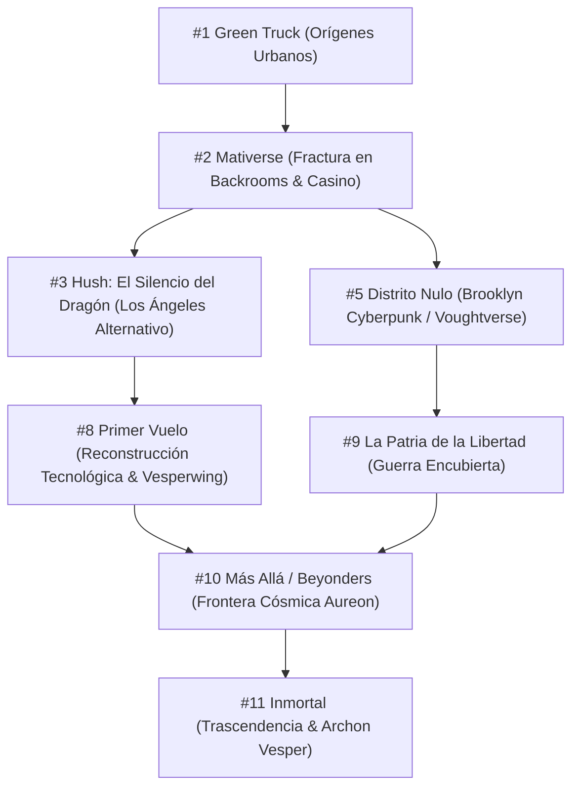
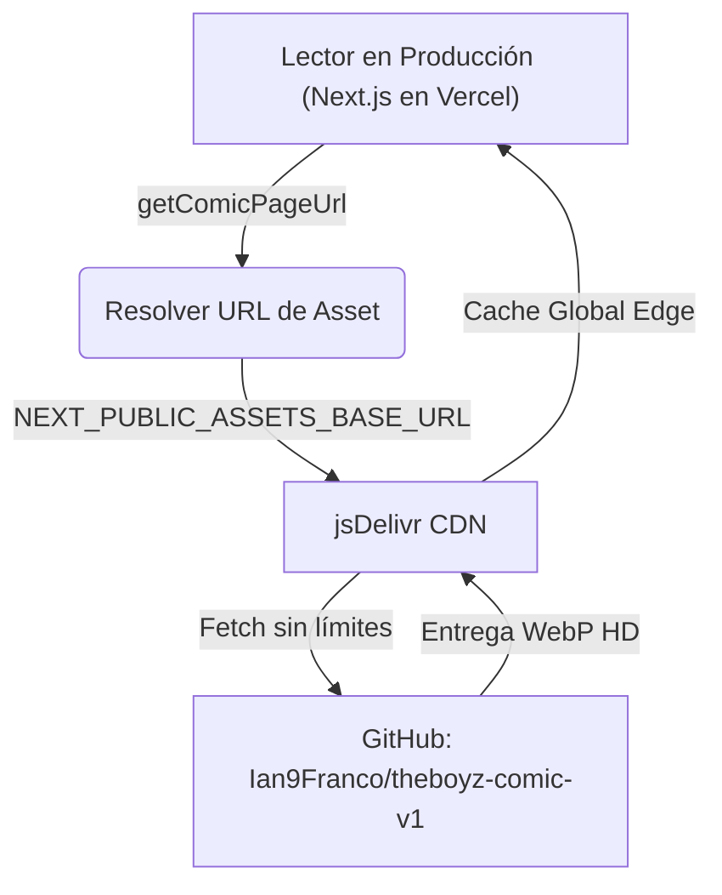

# ⚡ ELSEFRAME COMICS — WEB READER & LORE PLATFORM

Plataforma web de lectura de cómics interactiva, ultra-dinámica y con estética Pop-Art / Sci-Fi de alto impacto, desarrollada con **Next.js 15** (App Router y Turbopack), **TypeScript**, **Vanilla CSS** y **Framer Motion**. 

Integra un **Lector Cinemático Inteligente**, un **Editor Visual de Diálogos y Trayectorias de Cámara en tiempo real**, un **Hub de Lore / Dossiers V.O.P.S.** con sistema de desbloqueo progresivo por lectura, y una **Arquitectura de Almacenamiento Desacoplada a Coste $0** mediante CDN jsDelivr.

---

## 🌌 1. Universo Elseframe: Lore y Canon de las Sagas

El universo de **Elseframe** narra los acontecimientos desencadenados por la incursión dimensional en los Backrooms y la **Guerra Mativersal**. Tras el escape dimensional, el grupo original ("Los Pibes") quedó fracturado y esparcido a través del multiverso, despertando habilidades anómalas en la mayoría mientras otros recurren a la ingeniería extrema para sobrevivir.



---

### 📚 Cronología y Estado de las Sagas

| Saga | Título | Estado | Capítulos | Sinopsis & Canon |
|---|---|---|:---:|---|
| **#1** | **Green Truck** *(Clásica)* | `draft` | 4 caps (35 págs) | **El origen:** Las desventuras cotidianas y callejeras de los pibes antes de la colisión dimensional. |
| **#2** | **Mativerse Part 1** *(Clásica)* | `draft` | 3 caps (47 págs) | **La fractura:** Incursión a los Backrooms, primer encuentro con variantes de Mati (*Mati Prime*) y dispersión multiversal. |
| **#3** | **Hush: El Silencio del Dragón** *(Oficial)* | `published` 🌟 | 2 caps (52 págs) | **El despertar en L.A.:** Ian, Uandi y Julián varados en Los Ángeles alternativo. Aparición de Sofi (**Hush**), combate contra Kenji y la mafia del Dragón. |
| **#5** | **Distrito Nulo** *(Oficial)* | `published` 🌟 | 3 caps (198 págs) | **Aislamiento en Voughtverse:** Volvo atrapado en una Brooklyn distópica. Despertar del poder *Null Vector* (*blink* de cortocircuito), enfrentamiento con Gorgon, Don, Phobos y Billy Butcher. |
| **#8** | **Primer Vuelo** *(Oficial)* | `published` 🌟 | 5 caps (341 págs) | **El ascenso de Vesperwing:** 2 años después de la caída, Ian compensa su falta de poderes creando tecnología táctica junto a Brooke (piloto), Daichi (contrabandista), BYTE (robot de combate) y Dusk. |
| **#9** | **La Patria de la Libertad** *(Oficial)* | `published` | 2 caps (37+ págs) | **Choque de frentes:** Consecuencias en el mundo corporativo de superhéroes y el despliegue estratégico de Volvo. |
| **#10** | **Más Allá / Beyonders** *(Oficial)* | `draft` ⏳ | 3 caps (196 págs) | **Frontera multiversal:** El Sistema Aureon, piratas dimensionales, Bandit y Farsight (Mati con visor táctico de fuego violeta). |
| **#11** | **Inmortal** *(Oficial)* | `draft` 🔒 | En desarrollo | **Destino cósmico:** La amenaza de la Sobrecarga de Aegis, Reverse Vector y la ascensión de Archon Vesper en Vesperia. |

---

### 👥 Roster Principal ("Los Pibes") y Evolución de Identidades

| Personaje | Alias Heroico | Naturaleza / Habilidades | Rol y Arco de Evolución |
|---|---|---|---|
| **Ian** | **Vesperwing** → *Archon Vesper* | **Humano Puro / Ingeniero Táctico.** Traje de combate, drones con sellos, visor analítico y cálculo de variables. | El único que no mutó en los Backrooms. Su obsesión por proteger al grupo mediante control absoluto de variables lo conduce a su evolución suprema. |
| **Uandi** | **Aegis** | **Batería Cinética y Regeneración.** Su fuerza e invulnerabilidad aumentan exponencialmente con su furia/presión emocional. | El escudo viviente del grupo. En momentos extremos entra en *Sobrecarga*, mutando su piel con runas rojas a costa de su juicio racional. |
| **Julián** | **Wildcard** | **Proyección de Energía Inestable & Ecos.** Glitch cromático azul/rojo, constructos tácticos y clones temporales. | El improvisador nato. Crea copias de sí mismo y armas de plasma inestables que distorsionan el espacio. |
| **Volvo** | **Null Vector** | **Interferencia Cuántica & Blink.** Cortocircuitos de sistemas, saltos instantáneos y hackeo dimensional (*Null State*). | Atrapado en realidades hostiles. Descubre la red de energía verde (*La Corriente*) mientras es acechado por su variante cósmica *Reverse Vector*. |
| **Mati** | **Swapfire / Farsight** | **Nexo Multiversal & Fuego Violeta.** Ráfagas de plasma destructivo emitidas desde los ojos. | Porta un visor táctico industrial diseñado por Ian para canalizar y no destruir su entorno con su poder de nexo dimensional. |
| **Jaz** | **Oracle / Sigil** | **Estudio Místico y Clarividencia.** Runas antiguas, percepción extrasensorial, escudos hexagonales y constructos dorados. | Evoluciona mediante conocimiento esotérico y comprensión de las frecuencias del multiverso. |
| **Sofi** | **Hush / Dusk** | **Percepción Espacial & Oído Absoluto.** Espadachina táctica urbana con katanas gemelas y sigilo total. | Nativa de la realidad alternativa de Los Ángeles; aliada crucial de Ian y el equipo en la superficie. |

---

## 🎨 2. Características de la Plataforma Web

```
               ┌────────────────────────────────────────────────────────┐
               │              ELSEFRAME COMICS PLATFORM                 │
               └──────────────────────────┬─────────────────────────────┘
                                          │
        ┌─────────────────────────────────┼─────────────────────────────────┐
        ▼                                 ▼                                 ▼
┌──────────────────┐            ┌──────────────────┐             ┌──────────────────┐
│  LECTOR & EDITOR │            │   HUB DE LORE    │             │  DISTRIBUCIÓN    │
│    CINEMÁTICO    │            │    V.O.P.S.      │             │    CDN ZERO-$    │
├──────────────────┤            ├──────────────────┤             ├──────────────────┤
│ • Zoom Viñeta    │            │ • Dossiers Pers. │             │ • Repo Web (0b)  │
│ • Bézier Tails   │            │ • Desbloqueo LS  │             │ • Repo Assets HD │
│ • Spoiler Masks  │            │ • Blueprints     │             │ • jsDelivr CDN   │
│ • Snap to Grid   │            │ • Timeline Din.  │             │ • Cache Busting  │
└──────────────────┘            └──────────────────┘             └──────────────────┘
```

### 📖 Lector Cinemático Inteligente (`/chapters/[id]`)
- **Lectura Guiada (Cinematic Zoom)**: Transiciones fluidas entre viñetas siguiendo trayectorias cinemáticas configurables (`focusY`, `zoomRects` y escalas de aumento).
- **Paneo y Zoom Libre**: Pinch-to-zoom en móviles, rueda de ratón en escritorio y panel pop-art flotante.
- **Spoiler Masking Dinámico**: Ocultamiento automático de viñetas posteriores en la misma página para preservar el impacto narrativo.
- **Tipografías Temáticas y Variantes**: Soporte de fuentes cómic profesionales (*Bangers*, *Anime Ace*, *CC Comicrazy*, *Orbitron*) y variantes de burbuja (Estándar, Pensamiento, Susurro, Grito con picos pop-art, Neón cibernético y SFX flotantes).

### ✍️ Editor de Diálogos Visual e Interactivo (Integrado en el Lector)
- **Drag & Drop Responsivo**: Posicionamiento arrastrable que calcula coordenadas porcentuales relativas a la resolución nativa de la página.
- **Cola Elástica de Bézier Inteligente**: Puntos de anclaje interactivos para curvar la cola del globo con precisión milimétrica hacia el personaje emisor.
- **Paradas de Cámara (Camera Stops Tab)**: Configuración y reordenamiento visual de rectángulos de zoom y focos de lectura.
- **Snap-to-Grid**: Rejilla magnética configurable para alineación milimétrica de viñetas y textos.

### 🛡️ Hub de Lore V.O.P.S. (`/lore`)
- **Dossiers Clasificados**: Fichas técnicas, estadísticas de combate, audios, citas célebres e ilustraciones en alta definición.
- **Sistema de Desbloqueo Progresivo**: Los personajes y planos se desbloquean automáticamente al completar la lectura de capítulos clave (almacenado en `localStorage: read-chapters` vía [unlockRules.ts](file:///d:/Dev/CodeProjects/COMIC/lib/characterData/unlockRules.ts)).
- **Blueprints Tecnológicos**: Esquemas interactivos de trajes, drones, naves y visores.
- **Línea Temporal Interactiva (Timeline)**: Cronología de eventos clasificados con estados de bloqueo/desbloqueo dinámicos.

---

## 📂 3. Estructura y Arquitectura del Código

```
├── app/
│   ├── chapters/[id]/page.tsx      # Lector de cómic cinemático
│   ├── lore/page.tsx               # Hub de Lore, Dossiers, Blueprints y Timeline
│   ├── api/                        # Endpoints: sagas, diálogos, auth y preview
│   └── page.tsx                    # Portada principal y cartelera de sagas
├── components/
│   ├── home/                       # Hero 3D, Cartelera de Sagas, Roster de Personajes
│   ├── reader/                     # Lector cinemático, Canvas interactivo y Editor
│   │   ├── bubbles/                # Componentes de globos: Standard, Thought, Caption
│   │   └── editor/                 # Pestañas de edición de diálogo, layouts y colas
│   └── lore/                       # DossierTab, BlueprintsTab, TimelineTab, Redacted
├── docs/                           # Documentación maestra, guiones, conceptos y prompts
│   ├── Master/                     # Guías núcleo, gráficas, narrativas y de desbloqueos
│   └── guiones/                    # Guiones completos desglosados por saga (#1 a #10)
├── lib/
│   ├── characterData/              # Datos de personajes, desbloqueos, deidades y lore
│   ├── serverData.ts               # Lógica del servidor para escanear y servir sagas
│   ├── chapterFiles.ts             # Acceso y parsing de diálogos y páginas
│   └── githubComics.ts             # Sincronización con el repositorio de assets
└── public/comics/                  # Estructura de sagas, capítulos y marcadores de imagen
```

---

## 📦 4. Arquitectura de Assets y CDN (jsDelivr) a Coste $0

Para optimizar rendimiento, despliegue y costes, el proyecto utiliza una arquitectura desacoplada en dos repositorios:



1. **Repositorio Web (`theboyz`)**: Código fuente, componentes UI, páginas y archivos `dialogues.json`. Las imágenes en `public/comics/` son marcadores vacíos de 0 bytes para que Next.js indexe la estructura.
2. **Repositorio de Assets (`theboyz-comic-v1`)**: Repositorio dedicado exclusivamente a alojar las imágenes reales `.webp` de alta fidelidad.
3. **Modo Producción**: Las imágenes se sirven directamente a través de `https://cdn.jsdelivr.net/gh/Ian9Franco/theboyz-comic-v1@main/comics/...` sin consumir bandwidth ni almacenamiento de Vercel.

---

## 🛠️ 5. Guía de Desarrollo Local y Publicación

### Requisitos Previos
- Node.js 18+ instalado
- Repositorio web (`theboyz`) y opcionalmente repositorio de assets (`the-boyz-comic`) clonados en la misma carpeta raíz.

### 🚀 Comandos Rápidos
```bash
# 1. Instalar dependencias
npm install

# 2. Servidor de desarrollo con Turbopack (localhost:3000)
npm run dev

# 3. Validar tipado y compilar bundle de producción
npm run build

# 4. Sincronizar marcadores de assets desde el repo local de cómics
npm run sync-assets
```

### ⚙️ Variables de Entorno (`.env.local`)
```env
# En desarrollo local (con servidor the-boyz-comic en puerto 8080):
NEXT_PUBLIC_ASSETS_BASE_URL="http://localhost:8080"

# En producción (Vercel):
# NEXT_PUBLIC_ASSETS_BASE_URL="https://cdn.jsdelivr.net/gh/Ian9Franco/theboyz-comic-v1@main"

# Contraseña maestra para acceder a borradores y editor visual:
PREVIEW_PASSWORD="tu_password_maestra"
```

---

## 🔒 6. Control de Acceso y Reglas de Estado

### Estados de Sagas y Capítulos (`saga.json` / `chapter.json`)

| Propiedad | Valor | Efecto en la Plataforma |
|---|---|---|
| `status` | `"published"` | **Público.** Accesible para todos los lectores sin contraseña. |
| `status` | `"draft"` | **Protegido.** Requiere la contraseña maestra `PREVIEW_PASSWORD` o la contraseña propia de la saga. |
| `nuevo` | `true` | **Destacado.** Aplica estilo Pop-Art resaltado y badge de *"¡ÚLTIMO LANZAMIENTO!"* en portada. |
| `proximamente`| `true` | **Teaser.** Muestra la saga con estética de blueprint/obra en construcción y bloqueo de lectura. |

---

## 🔑 7. Configuración de Desbloqueos de Personajes y Lore

Para vincular un nuevo personaje al progreso de lectura del usuario:

1. **Personajes ([unlockRules.ts](file:///d:/Dev/CodeProjects/COMIC/lib/characterData/unlockRules.ts))**:
   ```typescript
   export const UNLOCK_RULES: Record<string, string[]> = {
     ian: [], // Siempre desbloqueado
     kenji: ['Un Lugar'], // Se desbloquea al leer "Un Lugar"
     gorgon: ['Pecados de Brooklyn-La mentira'], // Se desbloquea al leer Distrito Nulo #2
   };
   ```
2. **Blueprints ([BlueprintsTab.tsx](file:///d:/Dev/CodeProjects/COMIC/components/lore/BlueprintsTab.tsx))**:
   Define la condición de lectura sobre el array de capítulos leídos:
   ```typescript
   const isVesperwingUnlocked = unlockAll || normalizedChapters.includes("primer vuelo");
   ```
3. **Timeline ([TimelineTab.tsx](file:///d:/Dev/CodeProjects/COMIC/components/lore/TimelineTab.tsx))**:
   Asigna el ID del capítulo al campo `unlockChapter` de cada evento histórico.

---

## 📜 Licencia, Autor y Créditos

Creado, escrito y desarrollado con pasión por **Ian Franco (Collada Pontorno)** y el equipo de **Elseframe Comics**. Todos los derechos reservados sobre personajes, universos, guiones y diseños visuales.

<div align="center">
  <br />

  [](https://ian-pontorno-portfolio.vercel.app/)
  [](https://github.com/Ian9Franco)
  [](https://ar.linkedin.com/in/ian-franco-collada-pontorno)
  [](https://www.instagram.com/ian.franco._/)

  <br /><br />

  **[🌐 Portfolio Web](https://ian-pontorno-portfolio.vercel.app/)** • **[🐙 GitHub (@Ian9Franco)](https://github.com/Ian9Franco)** • **[💼 LinkedIn](https://ar.linkedin.com/in/ian-franco-collada-pontorno)** • **[📸 Instagram (@ian.franco._)](https://www.instagram.com/ian.franco._/)**

</div>
